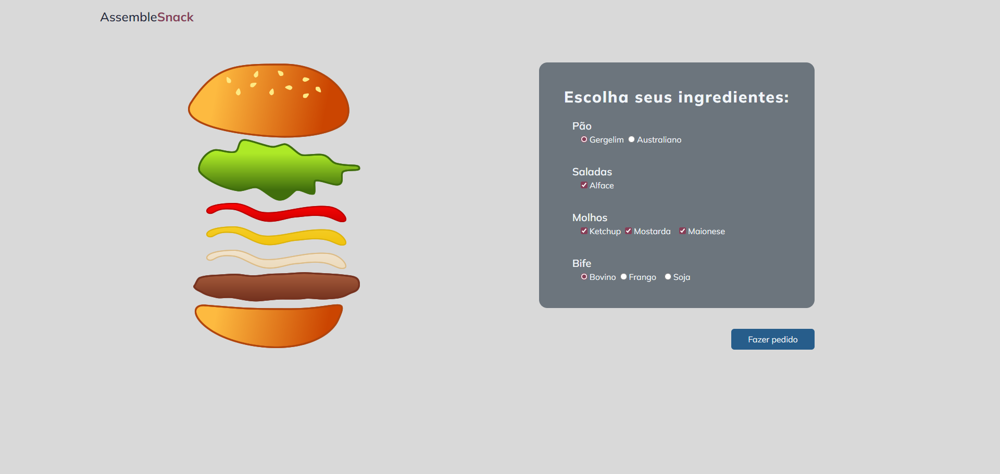
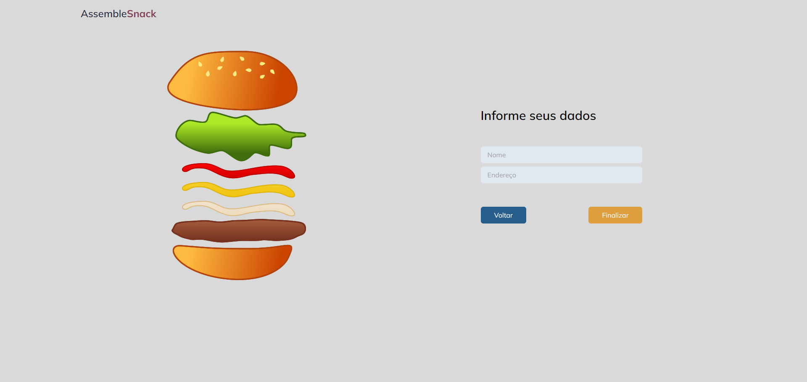

# AssembleSnack
O AssembleSnack é uma aplicação web simples onde os usuários podem montar seu próprio sanduíche, escolhendo os ingredientes desejados, como tipo de pão, alface, molhos e tipo de bife. Após a montagem, o usuário pode fazer um pedido informando seu nome e endereço para finalizar a compra.
<br>
<br>




# Design e Funcionalidade
A aplicação é dividido em duas etapas principais:

### Montagem do Sanduíche:

- O usuário inicia com todos os ingredientes em branco, apenas com o contorno da imagem visível.
- Ao fazer suas escolhas, as imagens dos ingredientes mudam para refletir o que foi escolhido.
- O usuário pode escolher o tipo de pão, adicionar alface, selecionar molhos (ketchup, mostarda, maionese) e escolher o tipo de bife (bovino, frango, soja).
- As escolhas do usuário são refletidas em tempo real na visualização do sanduíche.

### Finalização do Pedido:

- Após montar o sanduíche, o usuário pode clicar em "Fazer pedido" para ir para a etapa de finalização.
- Na etapa de finalização, o usuário informa seu nome e endereço.
- Ao clicar em "Finalizar", o pedido é concluído, e uma mensagem de sucesso é exibida.

# Tecnologias
O projeto foi desenvolvido utilizando as seguintes tecnologias:

- **Vue.js:** Framework JavaScript progressivo para a construção de interfaces de usuário interativas.
- **Vite:** Build tool que oferece um ambiente de desenvolvimento rápido e configuração simplificada para projetos Vue.js.
- **TailwindCSS:** Framework CSS utilitário para criação de estilos personalizados de forma rápida e eficiente.
- **JavaScript (ES6+):** Utilizado para a lógica de funcionamento da aplicação, como mudança dinâmica das imagens dos ingredientes.
- **HTML5:** Estruturação básica da página web.
- **CSS3:** Estilização adicional e ajustes visuais.

# Construção do Projeto
O projeto foi estruturado utilizando componentes Vue.js para uma melhor organização e reutilização de código. Essa é uma visão geral dos principais componentes:

### MainComponent:
- Componente principal que incorpora o HeaderCompoentVue e o ContainerComponentVue na página.
  
### HeaderComponent:
- Exibe o título "AssembleSnack" na parte superior da página.

### ContainerComponent:
- Contém o SnackComponentVue (que mostra a visualização dinâmica do sanduíche conforme as escolhas do usuário) e o ChoicesComponentVue (onde o usuário faz suas escolhas de ingredientes).

### SnackComponent:
- Mostra a visualização do sanduíche com imagens dinâmicas dos ingredientes conforme as escolhas do usuário.
  
### ChoicesComponent:
- Permite ao usuário fazer escolhas de ingredientes através de radio buttons e checkboxes.

### FinishOrderComponent:
- Etapa final onde o usuário informa seu nome e endereço para finalizar o pedido.

# Como executar o projeto
Para utilizar esse projeto na sua máquina local siga estas etapas:
- Certifique-se de ter o **Node.js** e o **npm** instalados em sua máquina.
- Clone o repositório para sua máquina local utilizando o seguinte comando:
```bash
  git clone https://github.com/ViniciusQuintas/assemble-snack.git
```
- Após clonar o repositório, navegue até o diretório do projeto no terminal:
```bash
  cd assemble-snack
```
- Instale todas as dependências do projeto listadas no arquivo `package.json` com o seguinte comando:
```bash
  npm install
```
- Após a instalação das dependências, execute o seguinte comando para para iniciar o servidor de desenvolvimento.
```bash
  npm run dev
```
- Por fim, abra o navegador e acesse `http://localhost:3000` para visualizar a aplicação.

# Contribuição
Se você deseja contribuir para o desenvolvimento desse projeto, siga os seguintes passos:

 1️⃣ Faça um fork deste repositório. 
<br>
<br>
 2️⃣ Crie uma nova branch para sua contribuição. 
<br>
<br>
 3️⃣ Faça suas alterações no código. 
<br>
<br>
 4️⃣ Certifique-se de que suas alterações não quebram o funcionamento existente do projeto. 
<br>
<br>
 5️⃣ Faça um pull request com suas alterações. 
<br>
<br>

# Licença
Este projeto está licenciado sob a Licença MIT. Consulte o arquivo LICENSE para obter mais informações.
